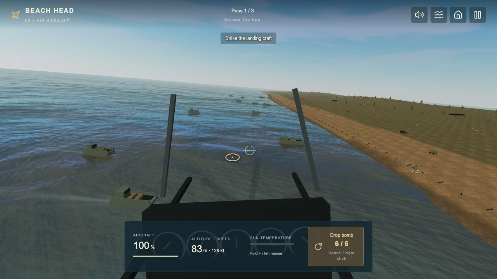

<div align="center">
  <a href="https://dbbaskette.github.io/BeachHead/">
    
  </a>

  <p><strong>A coastal battle, from the gun deck to the pillbox to the cockpit.</strong></p>

  <a href="https://github.com/dbbaskette/BeachHead/actions/workflows/pages.yml"></a>
  <a href="https://github.com/dbbaskette/BeachHead/issues?q=is%3Aissue+is%3Aopen+label%3Astage-3-task"></a>
  <a href="https://github.com/dbbaskette/BeachHead/issues?q=is%3Aissue+is%3Aclosed+label%3Astage-3-task"></a>

  <p><a href="https://dbbaskette.github.io/BeachHead/"><strong>▶ PLAY NOW</strong></a> &nbsp; · &nbsp; <a href="https://github.com/dbbaskette/BeachHead/issues/3">Stage 3 roadmap</a> &nbsp; · &nbsp; <a href="#controls">Controls</a> &nbsp; · &nbsp; <a href="#run-locally">Run locally</a></p>
</div>

A 3D browser game inspired by **Beach-Head** and **Beach-Head II**. Break a naval blockade, hold a captured pillbox against a landing force, then fly three attack passes over the coast. Textured battlefields, physically consistent weapon origins, smoke, persistent wrecks and spatial weapon effects bring the classic idea into a modern browser.

**All three stages are playable.** Choose **Play campaign** for the complete sea–beach–air operation, or jump straight into any stage from the main menu. No installation or account is required to play. WebGL 2 and hardware acceleration are required.

## The campaign

<table>
  <tr>
    <td width="50%" valign="top">
      <a href="https://dbbaskette.github.io/BeachHead/"></a>
      <h3>01 / Break the blockade</h3>
      <p><strong>PLAYABLE · NAVAL GUNNERY</strong></p>
      <p>Set bearing and range, lead moving warships, and correct your next salvo from the splashes. Both shells leave the actual barrels along their bore direction. Use the magnified optic for distant targets.</p>
    </td>
    <td width="50%" valign="top">
      <a href="https://dbbaskette.github.io/BeachHead/"></a>
      <h3>02 / Hold the beach</h3>
      <p><strong>PLAYABLE · PILLBOX DEFENSE</strong></p>
      <p>Repel three waves. Infantry shelter in foxholes, crawl behind cover and use smoke. Stop jeeps and landing-craft gunners; manage gun heat, rifle grenades and earned air support.</p>
    </td>
  </tr>
</table>

Actual gameplay captures. All stages keep floating enemy labels, health bars and hit reports out of the battlefield. Read damage from impacts, smoke and wreckage; weapon instruments stay at the edges.

## 03 / Break the landing

[](https://dbbaskette.github.io/BeachHead/)

**PLAYABLE · GUIDED FIGHTER-BOMBER MISSION**

Fly three automatic attack passes across the bay, along the beach and against the striped command transport. Control your bank and altitude, strafe with twin guns and choose where to spend **six bombs for the entire mission**. Destroy the command transport and survive the exit to win. Shore flak commits to a point when fired: change your line after launch, or silence the batteries before later passes.

The circular crosshair follows the guns; the amber ring shows where a bomb released now would land. Bombs inherit your movement and fall under gravity. Moving craft still require a lead. Smoke, sinking wrecks, interrupted unloading and surviving defenses persist between passes. A full mission lasts about **2½ minutes**.

[Validation and measured limits](docs/stage-3-validation.md) · [Flight and asset notes](docs/air-assets.md) · [Remaining playtest work](https://github.com/dbbaskette/BeachHead/issues/12)

[Read the mission design](docs/stage-3-air-assault-plan.md) · [Implementation plan](docs/superpowers/plans/2026-09-30-stage-3-air-assault.md) · [Issue dependency index](docs/stage-3-issues.md)

## Controls

| Action | Stage 1 — Naval battle | Stage 2 — Beach defense | Stage 3 — Air assault |
| --- | --- | --- | --- |
| Aim / fly | Mouse; WASD / arrows | Mouse; WASD / arrows | Move mouse; WASD / arrows |
| Fire guns | Hold left mouse or Space | Hold left mouse or Space | Hold left mouse or **F** |
| Range / altitude | Mouse wheel; W/S | Mouse wheel; W/S | Mouse up/down; W/S or up/down arrows |
| Fine control | Shift / right mouse | Small pointer movements | **Shift** |
| Special actions | Z: optic · Tab: target | G: grenade · V: air support | **Space / right click: drop one bomb** |
| Pause | Escape / pause button | Escape / pause button | Escape / pause button |
| Leave the mission | Main menu / pause menu | Main menu / pause menu | Main menu / pause menu |

All stages have visible controls, mute and reduced camera motion. Leaving the tab pauses combat. Focused buttons retain normal keyboard behavior.

**Phones and tablets:** the game automatically switches to touch controls with a clear central view. In Stage 1, gently move and hold the left pad to aim; hold Fire to shoot again after reloading, tap the target readout to cycle ships, and tap the optic for a closer view. In Stage 2, swipe the left pad to aim: the sight stops when your thumb stops. Lift and swipe again to keep moving. Hold Fire with your other thumb, use short bursts, and tap the grenade / air-support buttons beside the controls (above them in portrait). Both thumbs work independently, and dragging the battlefield also adjusts aim without firing. In Stage 3, the left pad controls bank and altitude, the right button fires the guns, and the separate Bomb button releases one bomb. You can also drag the sky to steer. Pause opens the route back to the menu.

Portrait and landscape are supported; landscape offers the widest view. Menus scroll on small screens, controls respect screen notches, and rotating or leaving the app pauses combat. Mobile rendering uses a lower pixel-density cap and shadow resolution. Device performance and touch feel still depend on the browser and hardware.

<details>
<summary><strong>Field notes: naval gunnery</strong></summary>

- Sink all three warships before your ship is destroyed. You have unlimited shells and a 2.2-second reload. Impact fires follow the struck part of the hull; sinking ships list, flood and leave drifting wreckage.
- Lead a moving target, then watch where the splashes fall to correct bearing and range. Tracking reports a target's position without automatically aiming at it.
- The gun pose, muzzle flashes and shell launch share one firing solution. Flight timing and gun elevations are compressed for arcade play.
- Vertical mouse aiming compensates for perspective at longer ranges. The visible cursor updates every rendered frame.
- Standalone Stage 1 ends at mission selection; a campaign victory continues to Stage 2.

</details>

<details>
<summary><strong>Field notes: holding the beach</strong></summary>

- Fire controlled bursts. Overheating locks the gun until it cools; a better barrel can be chosen between waves.
- Soldiers occupy foxholes, peek and duck. Catch them exposed or use a rifle grenade to clear cover. Bullets pass through smoke; terrain and cover can protect soldiers.
- Stop reinforcement jeeps before they unload, silence craft gunners, and damage ramps to delay the landing. Watch for grenade throws and mortar or MG crews.
- G throws a rifle grenade toward your aim point, up to 115 m. V calls earned air support along the aimed line. Both actions also have buttons.
- After each wave, choose bunker repair, an improved barrel or extra grenades. Hold through three waves; retry starts Stage 2 again.
- Enemy labels, health bars, setup timers and hit reports are intentionally absent from the battlefield.

[Detailed combat rules and tuning](docs/stage-2-threats.md)

</details>

## Run locally

Use **Node 22.13+** and npm.

```sh
npm ci
npm run dev -- --port 3077
```

Open the local URL printed by the server. The game uses React, TypeScript, Three.js and Vinext/Vite. Combat simulation is separated from rendering and audio.

<details>
<summary><strong>Checks, deployment and project map</strong></summary>

```sh
npm test
npm run typecheck
npm exec oxlint -- app lib/naval lib/pillbox lib/air
NEXT_PUBLIC_BASE_PATH=/BeachHead npm run build
```

The Pages workflow runs these checks and publishes `dist/client/` after a push to `main`. Its live badge is at the top of this README. A normal development build uses the root URL. Asset paths use `lib/asset-url.ts` so the public game works under `/BeachHead/`.

| Area | Location |
| --- | --- |
| Campaign routing and game interfaces | `app/campaign.tsx`, `app/naval-game.tsx`, `app/pillbox-game.tsx`, `app/air-game.tsx` |
| Naval simulation, gun solution, scene, models and audio | `lib/naval/` |
| Infantry, cover, landing craft, terrain and beach combat | `lib/pillbox/` |
| Guided flight, ballistic weapons, coastal targets, effects and audio | `lib/air/` |
| Local textures, models and sound effects | `public/` |
| Designs, validation notes and asset provenance | `docs/` |

Simulation tests cover combat, progression, pause/retry, trajectories and resource cleanup. Browser checks cover rendering and input. Frame rate, balance and subjective sound quality still need measurement on the intended player hardware. The generated component catalog has existing lint findings outside the authored game paths; the scoped check above is the release gate.

Optional WebMCP controls support game status and actions in compatible browsers. Ordinary play does not depend on them. `.openai/hosting.json` retains the separate Sites deployment configuration; the public play link above uses GitHub Pages.

</details>

## Credits and provenance

Inspired by the original **Beach-Head** games. This is an evolving three-stage arcade game, not a reproduction of every original mission or a full flight simulator.

- [Naval visuals and textures](docs/visual-assets.md) · [Naval audio](docs/audio-assets.md)
- [Infantry assets](docs/infantry-assets.md) · [Beach surfaces and detail](docs/pillbox-visual-assets.md)
- [Pillbox audio sources and adaptations](docs/pillbox-audio-assets.md), including **Light Machine Gun** by **KuraiWolf**, CC BY 4.0
- README banner: original SVG artwork. Screenshots: current game captures. Live issue badges: [Shields.io](https://shields.io/).

---

<p align="center"><a href="https://dbbaskette.github.io/BeachHead/"><strong>TAKE YOUR STATION → PLAY BEACH HEAD</strong></a></p>
